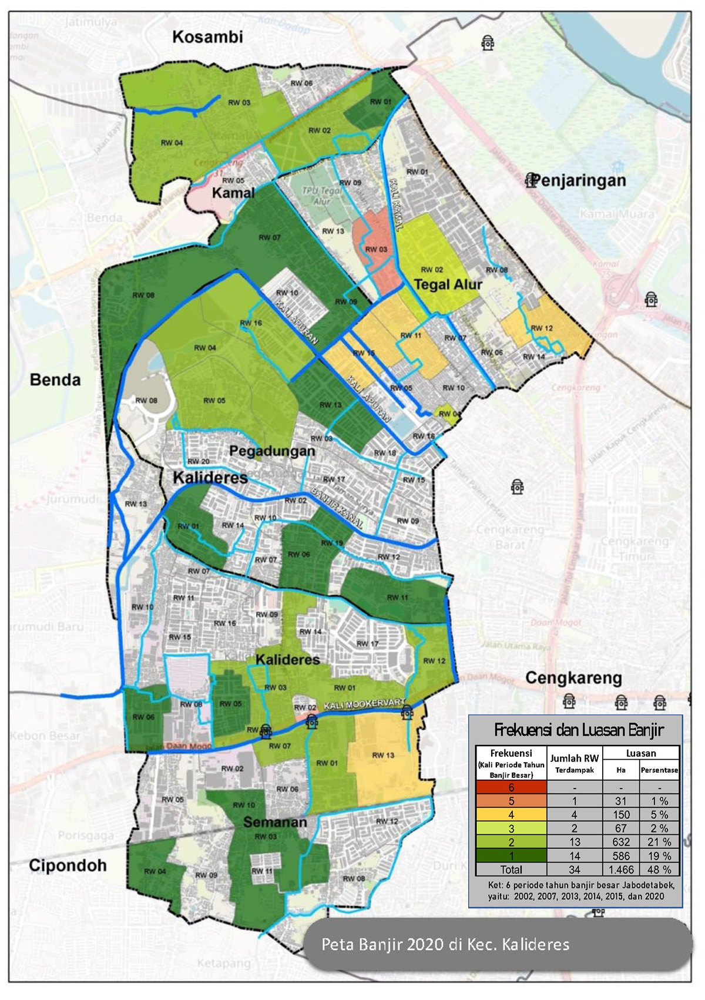

### Hi there 👋

## Ferdinan Aurifio Here

GIS Specialist with 9+ years of experience in spatial data management, geospatial analysis and mapping for spatial planning, land-use enforcement, flood risk assessment, and infrastructure development across various regions in Indonesia. Skilled in compiling and validating RTRW data, mapping Lahan Sawah Dilindungi (LSD), conducting aerial imagery processing, and performing technical and legal studies on spatial-use violations. Proficient in ArcGIS, ArcGIS Pro, QGIS, Agisoft, Google Earth Engine, and spatial databases, with strong ability to transform complex geospatial data into actionable insights, thematic maps, and reports that support policymaking, legal enforcement, and sustainable land management.

<!-- **fiopiohoho/fiopiohoho** is a ✨ _special_ ✨ repository because its `README.md` (this file) appears on your GitHub profile. -->

## Formal Education

[Universitas Indonesia, Depok](https://www.ui.ac.id/)

- Majoring in Geography
- Faculty of Mathematics and Natural Science
- GPA (3.26)

## Employement

- [Staff GIS Ministry of Agrarian Affairs and Spatial Planning (Directorat General of Spatial Planning)](https://ditjenpptr.atrbpn.go.id/pengendalian/)
- [Staff GIS Ministry of Agrarian Affairs and Spatial Planning (Directorat General of Spatial Development Control)](https://tataruang.atrbpn.go.id/)
- [Staff GIS BPBD DKI Jakarta](https://bpbd.jakarta.go.id/)

## Profesional Skills

- Ms. Office
- Google Earth Engine
- ArcGis
- Qgis
- Global Mapper
- ENVI
- Quantitative Research
- SPSS

## Portofolio

1. Spatial data analysis map of suspected area that utilizing protected forest areas for housing development in Batam from 2018 to 2022.
   (Ministry of Agrarian Affairs and Spatial Plan/National Land Agency) 

2. Mapping and prepare structure data base for planting area and construction infiltration wells in order to restoration of "Puncak, Bogor" due to misuse space utilization in 2020-2021
   (Ministry of Agrarian Affairs and Spatial Plan/National Land Agency)
   for the detail, [visit https://ditjenpptr.atrbpn.go.id/sihero/](https://ditjenpptr.atrbpn.go.id/sihero/) (image of planting bamboo on the banks of the river)
    (image location construction of infiltration wells in Batulayang Village)

3. Map of Flood Frequency Analysis in Kalideres-2020
   (Ministry of Agrarian Affairs and Spatial Plan/National Land Agency)
   

4. Study the potential for the new development areas based on toll road infrastructure in Sumatra-2019
   (Ministry of Agrarian Affairs and Spatial Plan/National Land Agency)

5. Presents data on maps that represent the performance of spatial planning in each province of Kalimantan and Sulawesi-2019. (Ministry of Agrarian Affairs and Spatial Plan/National Land Agency)

6. Correcting topology spatial plan data in Papua Districts for input public webgis known as [GISTARU](https://gistaru.atrbpn.go.id/rtronline/) (Ministry of Agrarian Affairs and Spatial Plan/National Land Agency)

7. Mapping and studying flood evacuation locations in several districts in Jakarta-2015
   (Badan Penanggulangan Bencana Daerah Provinsi DKI Jakarta)

### Fire up Lerning Open-source Projects

- **Python packages:** [geemap](https://github.com/giswqs/geemap) | [leafmap](https://github.com/giswqs/leafmap)
- **Google Earth Engine:** [Awesome-GEE](https://github.com/giswqs/Awesome-GEE) | [earthengine-py-notebooks](https://github.com/giswqs/earthengine-py-notebooks) | [qgis-earthengine-examples](https://github.com/giswqs/qgis-earthengine-examples) | [earthengine-apps](https://github.com/giswqs/earthengine-apps)
