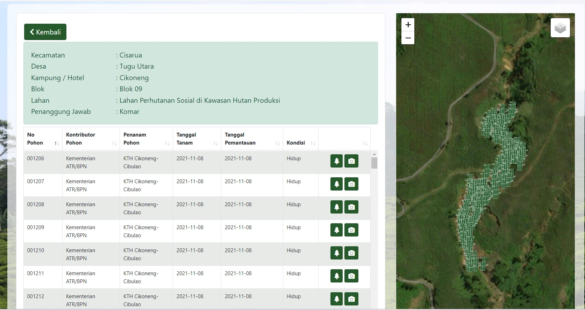

### Hi there 👋

## Ferdinan Aurifio Here

A Gis Specialist with 4+ years of experience. Familiar with spatial data creation for map such as landuse planning, terrain mapping, forest monitoring, dissaster mapping, and spatial planning zone. Proven to assisted director general for made decision about actions to save “Kawasan Puncak Bogor” and many more. fire up in learning software development for geospatial analysist like various python packages and Google earth engine

<!-- **fiopiohoho/fiopiohoho** is a ✨ _special_ ✨ repository because its `README.md` (this file) appears on your GitHub profile. -->

## Formal Education

[Universitas Indonesia, Depok](https://www.ui.ac.id/)

- Majoring in Geography
- Faculty of Mathematics and Natural Science
- GPA (3.26)

## Employement

- [Staff GIS Ministry of Agrarian Affairs and Spatial Planning (Directorat General of Spatial Development Control)](https://tataruang.atrbpn.go.id/)
- [Staff GIS Ministry of Agrarian Affairs and Spatial Planning (Directorat General of Spatial Planning)](https://ditjenpptr.atrbpn.go.id/pengendalian/)
- [Staff GIS BPBD DKI Jakarta](https://bpbd.jakarta.go.id/)

## Profesional Skills

- Ms. Office
- Google Earth Engine
- ArcGis
- Qgis
- Global Mapper
- ENVI
- Quantitative Research
- SPSS

## Portofolio

1. Spatial data analysis map of suspected area that utilizing protected forest areas for housing development in Batam from 2018 to 2022.
   (Ministry of Agrarian Affairs and Spatial Plan/National Land Agency) 

2. Mapping and prepare structure data base for planting area and construction infiltration wells in order to restoration of "Puncak, Bogor" due to misuse space utilization in 2020-2021
   (Ministry of Agrarian Affairs and Spatial Plan/National Land Agency)
   for the detail, [visit https://ditjenpptr.atrbpn.go.id/sihero/](https://ditjenpptr.atrbpn.go.id/sihero/) (image of planting bamboo on the banks of the river)
    (image location construction of infiltration wells in Batulayang Village)

3.

4.

5. Presents data on maps that represent the performance of spatial planning in each province of Kalimantan and Sulawesi-2019. (Ministry of Agrarian Affairs and Spatial Plan/National Land Agency)

### Fire up Lerning Open-source Projects

- **Python packages:** [geemap](https://github.com/giswqs/geemap) | [leafmap](https://github.com/giswqs/leafmap)
- **Google Earth Engine:** [Awesome-GEE](https://github.com/giswqs/Awesome-GEE) | [earthengine-py-notebooks](https://github.com/giswqs/earthengine-py-notebooks) | [qgis-earthengine-examples](https://github.com/giswqs/qgis-earthengine-examples) | [earthengine-apps](https://github.com/giswqs/earthengine-apps)
